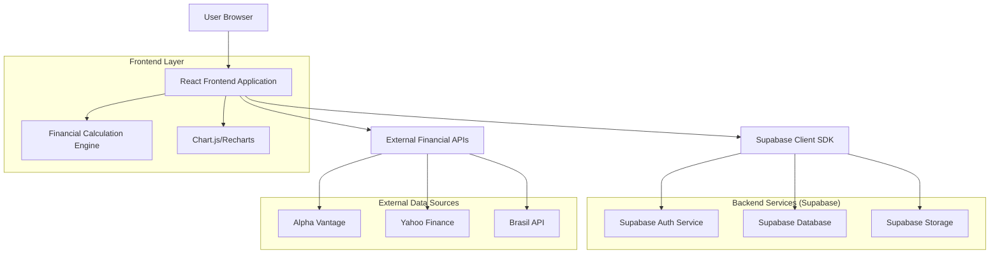
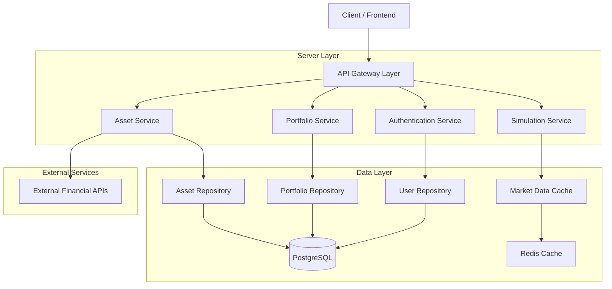
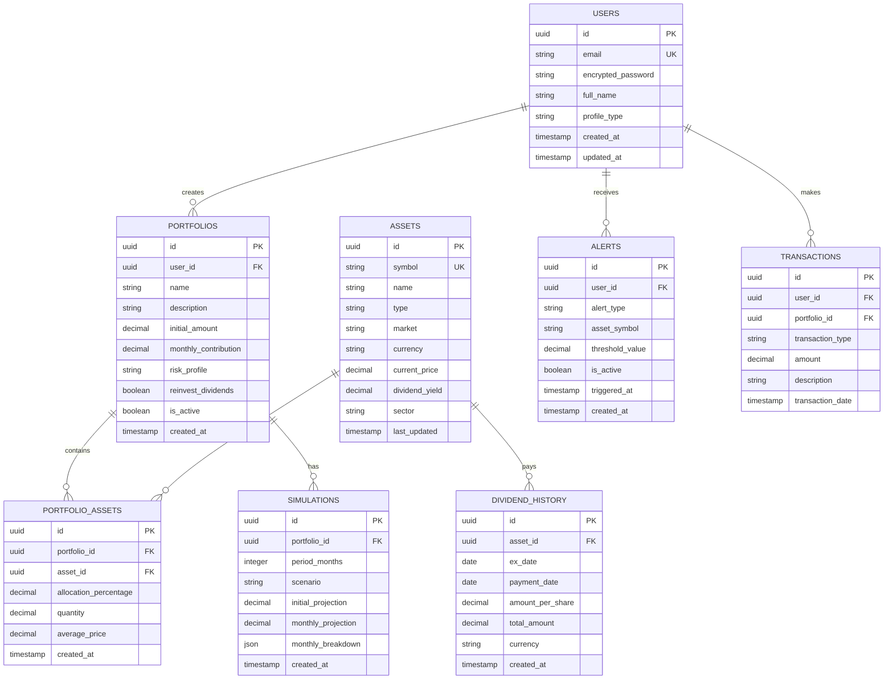

## 1.Architecture design



## 2.Technology Description
- Frontend: React@18 + TypeScript@5 + Vite@4
- UI Framework: Tailwind CSS@3 + Headless UI
- Charts: Recharts@2 + Chart.js@4
- State Management: Zustand@4 + React Query@5
- Forms: React Hook Form@7 + Zod@3
- Initialization Tool: vite-init
- Backend: Supabase (BaaS)
- Database: PostgreSQL (via Supabase)
- Authentication: Supabase Auth
- Real-time: Supabase Realtime
- External APIs: Alpha Vantage, Yahoo Finance, Brasil API

## 3.Route definitions
| Route | Purpose |
|-------|---------|
| / | Landing page com call-to-action para login |
| /login | Autenticação de usuários |
| /register | Cadastro de novos usuários |
| /dashboard | Visão geral da carteira e métricas principais |
| /carteiras | Listagem e gestão de carteiras |
| /carteiras/nova | Criação de nova carteira |
| /carteiras/:id | Detalhes e edição de carteira específica |
| /simulador | Projeções financeiras e simulações |
| /dividendos | Calendário e análise de proventos |
| /alertas | Central de notificações e alertas |
| /comparador | Comparação entre carteiras |
| /configuracoes | Preferências e perfil do usuário |

## 4.API definitions

### 4.1 Authentication APIs
```
POST /auth/v1/token
```
Request:
| Param Name | Param Type | isRequired | Description |
|------------|------------|------------|-------------|
| email | string | true | Email do usuário |
| password | string | true | Senha (mínimo 6 caracteres) |

Response:
| Param Name | Param Type | Description |
|------------|------------|-------------|
| access_token | string | JWT token para autenticação |
| refresh_token | string | Token para renovação |
| user | object | Dados do usuário autenticado |

### 4.2 Portfolio APIs
```
GET /rest/v1/portfolios
```
Response:
```json
{
  "data": [
    {
      "id": "uuid",
      "name": "Minha Carteira Arrojada",
      "description": "Foco em renda mensal",
      "total_value": 150000.00,
      "expected_monthly_income": 1250.50,
      "created_at": "2024-01-01T00:00:00Z"
    }
  ]
}
```

```
POST /rest/v1/portfolios
```
Request:
| Param Name | Param Type | isRequired | Description |
|------------|------------|------------|-------------|
| name | string | true | Nome da carteira |
| description | string | false | Descrição opcional |
| initial_amount | number | true | Aporte inicial |
| monthly_contribution | number | true | Aporte mensal |
| profile | string | true | Perfil: 'conservative', 'moderate', 'aggressive' |

### 4.3 Assets APIs
```
GET /rest/v1/assets
```
Query Parameters:
| Param Name | Param Type | Description |
|------------|------------|-------------|
| type | string | Filtrar por tipo: 'stock', 'fii', 'etf', 'reit' |
| market | string | Filtrar por mercado: 'BR', 'US' |
| dividend_yield_min | number | Dividend yield mínimo |

### 4.4 Simulation APIs
```
POST /rest/v1/simulations
```
Request:
| Param Name | Param Type | isRequired | Description |
|------------|------------|------------|-------------|
| portfolio_id | string | true | ID da carteira |
| period_months | number | true | Período em meses |
| scenario | string | true | Cenário: 'conservative', 'moderate', 'aggressive' |
| reinvest_dividends | boolean | true | Reinvestir dividendos |
| monthly_contribution | number | true | Aporte mensal |

## 5.Server architecture diagram


## 6.Data model

### 6.1 Data model definition


### 6.2 Data Definition Language

```sql
-- Users table
CREATE TABLE users (
  id UUID PRIMARY KEY DEFAULT gen_random_uuid(),
  email VARCHAR(255) UNIQUE NOT NULL,
  encrypted_password VARCHAR(255) NOT NULL,
  full_name VARCHAR(255) NOT NULL,
  profile_type VARCHAR(50) DEFAULT 'standard' CHECK (profile_type IN ('standard', 'premium')),
  created_at TIMESTAMP WITH TIME ZONE DEFAULT NOW(),
  updated_at TIMESTAMP WITH TIME ZONE DEFAULT NOW()
);

-- Portfolios table
CREATE TABLE portfolios (
  id UUID PRIMARY KEY DEFAULT gen_random_uuid(),
  user_id UUID REFERENCES users(id) ON DELETE CASCADE,
  name VARCHAR(255) NOT NULL,
  description TEXT,
  initial_amount DECIMAL(12,2) NOT NULL DEFAULT 0,
  monthly_contribution DECIMAL(12,2) NOT NULL DEFAULT 0,
  risk_profile VARCHAR(20) CHECK (risk_profile IN ('conservative', 'moderate', 'aggressive')),
  reinvest_dividends BOOLEAN DEFAULT true,
  is_active BOOLEAN DEFAULT true,
  created_at TIMESTAMP WITH TIME ZONE DEFAULT NOW(),
  updated_at TIMESTAMP WITH TIME ZONE DEFAULT NOW()
);

-- Assets table
CREATE TABLE assets (
  id UUID PRIMARY KEY DEFAULT gen_random_uuid(),
  symbol VARCHAR(20) UNIQUE NOT NULL,
  name VARCHAR(255) NOT NULL,
  type VARCHAR(50) CHECK (type IN ('stock', 'fii', 'etf', 'reit', 'bond')),
  market VARCHAR(10) CHECK (market IN ('BR', 'US')),
  currency VARCHAR(3) DEFAULT 'BRL',
  current_price DECIMAL(12,4),
  dividend_yield DECIMAL(5,2),
  sector VARCHAR(100),
  last_updated TIMESTAMP WITH TIME ZONE DEFAULT NOW()
);

-- Portfolio assets (many-to-many)
CREATE TABLE portfolio_assets (
  id UUID PRIMARY KEY DEFAULT gen_random_uuid(),
  portfolio_id UUID REFERENCES portfolios(id) ON DELETE CASCADE,
  asset_id UUID REFERENCES assets(id) ON DELETE CASCADE,
  allocation_percentage DECIMAL(5,2) NOT NULL CHECK (allocation_percentage >= 0 AND allocation_percentage <= 100),
  quantity DECIMAL(12,4) NOT NULL DEFAULT 0,
  average_price DECIMAL(12,4) NOT NULL DEFAULT 0,
  created_at TIMESTAMP WITH TIME ZONE DEFAULT NOW(),
  UNIQUE(portfolio_id, asset_id)
);

-- Dividend history
CREATE TABLE dividend_history (
  id UUID PRIMARY KEY DEFAULT gen_random_uuid(),
  asset_id UUID REFERENCES assets(id) ON DELETE CASCADE,
  ex_date DATE NOT NULL,
  payment_date DATE NOT NULL,
  amount_per_share DECIMAL(12,4) NOT NULL,
  total_amount DECIMAL(12,2) NOT NULL,
  currency VARCHAR(3) DEFAULT 'BRL',
  created_at TIMESTAMP WITH TIME ZONE DEFAULT NOW()
);

-- Simulations
CREATE TABLE simulations (
  id UUID PRIMARY KEY DEFAULT gen_random_uuid(),
  portfolio_id UUID REFERENCES portfolios(id) ON DELETE CASCADE,
  period_months INTEGER NOT NULL,
  scenario VARCHAR(20) CHECK (scenario IN ('conservative', 'moderate', 'aggressive')),
  initial_projection DECIMAL(15,2) NOT NULL,
  monthly_projection DECIMAL(15,2) NOT NULL,
  monthly_breakdown JSONB NOT NULL,
  created_at TIMESTAMP WITH TIME ZONE DEFAULT NOW()
);

-- Alerts
CREATE TABLE alerts (
  id UUID PRIMARY KEY DEFAULT gen_random_uuid(),
  user_id UUID REFERENCES users(id) ON DELETE CASCADE,
  alert_type VARCHAR(50) CHECK (alert_type IN ('dividend_drop', 'volatility_increase', 'price_target', 'portfolio_deviation')),
  asset_symbol VARCHAR(20),
  threshold_value DECIMAL(12,2),
  is_active BOOLEAN DEFAULT true,
  triggered_at TIMESTAMP WITH TIME ZONE,
  created_at TIMESTAMP WITH TIME ZONE DEFAULT NOW()
);

-- Indexes for performance
CREATE INDEX idx_portfolios_user_id ON portfolios(user_id);
CREATE INDEX idx_portfolio_assets_portfolio_id ON portfolio_assets(portfolio_id);
CREATE INDEX idx_portfolio_assets_asset_id ON portfolio_assets(asset_id);
CREATE INDEX idx_dividend_history_asset_id ON dividend_history(asset_id);
CREATE INDEX idx_dividend_history_ex_date ON dividend_history(ex_date);
CREATE INDEX idx_simulations_portfolio_id ON simulations(portfolio_id);
CREATE INDEX idx_alerts_user_id ON alerts(user_id);
CREATE INDEX idx_alerts_asset_symbol ON alerts(asset_symbol);

-- Row Level Security (RLS) policies
ALTER TABLE portfolios ENABLE ROW LEVEL SECURITY;
ALTER TABLE portfolio_assets ENABLE ROW LEVEL SECURITY;
ALTER TABLE simulations ENABLE ROW LEVEL SECURITY;
ALTER TABLE alerts ENABLE ROW LEVEL SECURITY;

-- Policies
CREATE POLICY "Users can view own portfolios" ON portfolios
  FOR SELECT USING (auth.uid() = user_id);

CREATE POLICY "Users can insert own portfolios" ON portfolios
  FOR INSERT WITH CHECK (auth.uid() = user_id);

CREATE POLICY "Users can update own portfolios" ON portfolios
  FOR UPDATE USING (auth.uid() = user_id);

CREATE POLICY "Users can delete own portfolios" ON portfolios
  FOR DELETE USING (auth.uid() = user_id);

-- Grant permissions
GRANT SELECT ON portfolios TO anon;
GRANT ALL PRIVILEGES ON portfolios TO authenticated;
GRANT SELECT ON assets TO anon;
GRANT SELECT ON dividend_history TO anon;
GRANT ALL PRIVILEGES ON simulations TO authenticated;
GRANT ALL PRIVILEGES ON alerts TO authenticated;

-- Sample data insertion
INSERT INTO assets (symbol, name, type, market, currency, current_price, dividend_yield, sector) VALUES
('VALE3', 'Vale S.A.', 'stock', 'BR', 'BRL', 65.20, 8.5, 'Mineração'),
('ITUB4', 'Itaú Unibanco', 'stock', 'BR', 'BRL', 28.15, 7.2, 'Bancos'),
('MXRF11', 'Maxi Renda FII', 'fii', 'BR', 'BRL', 9.85, 9.1, 'Títulos e Valores'),
('IVVB11', 'iShares S&P 500', 'etf', 'BR', 'BRL', 245.30, 1.8, 'ETF Internacional'),
('VYM', 'Vanguard High Dividend Yield', 'etf', 'US', 'USD', 105.20, 2.9, 'ETF Dividendos'),
('O', 'Realty Income Corp', 'reit', 'US', 'USD', 62.15, 5.4, 'REIT'),
('AAPL', 'Apple Inc', 'stock', 'US', 'USD', 185.90, 0.5, 'Tecnologia');
```

## 7.Financial Calculation Engine

### 7.1 Core Calculations
```typescript
// Compound Interest with monthly contributions
export function calculateCompoundInterest(
  principal: number,
  monthlyContribution: number,
  annualRate: number,
  years: number,
  compoundFrequency: number = 12
): number {
  const monthlyRate = annualRate / compoundFrequency;
  const totalMonths = years * compoundFrequency;
  
  let futureValue = principal * Math.pow(1 + monthlyRate, totalMonths);
  
  for (let i = 0; i < totalMonths; i++) {
    futureValue += monthlyContribution * Math.pow(1 + monthlyRate, totalMonths - i);
  }
  
  return futureValue;
}

// Dividend Yield calculation
export function calculateDividendYield(
  annualDividend: number,
  currentPrice: number
): number {
  return (annualDividend / currentPrice) * 100;
}

// Portfolio volatility (standard deviation)
export function calculatePortfolioVolatility(
  returns: number[]
): number {
  const mean = returns.reduce((sum, r) => sum + r, 0) / returns.length;
  const variance = returns.reduce((sum, r) => sum + Math.pow(r - mean, 2), 0) / returns.length;
  return Math.sqrt(variance);
}

// Maximum Drawdown
export function calculateMaxDrawdown(
  portfolioValues: number[]
): number {
  let maxDrawdown = 0;
  let peak = portfolioValues[0];
  
  for (const value of portfolioValues) {
    if (value > peak) {
      peak = value;
    }
    
    const drawdown = (peak - value) / peak;
    if (drawdown > maxDrawdown) {
      maxDrawdown = drawdown;
    }
  }
  
  return maxDrawdown * 100;
}

// CAGR (Compound Annual Growth Rate)
export function calculateCAGR(
  beginningValue: number,
  endingValue: number,
  years: number
): number {
  return (Math.pow(endingValue / beginningValue, 1 / years) - 1) * 100;
}
```

### 7.2 AI Recommendation Engine
```typescript
interface AIRecommendation {
  asset: Asset;
  score: number;
  reasons: string[];
  expectedReturn: number;
  riskLevel: 'low' | 'medium' | 'high';
}

export function generateAIRecommendations(
  portfolio: Portfolio,
  marketData: MarketData[],
  userProfile: UserProfile
): AIRecommendation[] {
  const recommendations: AIRecommendation[] = [];
  
  // Score calculation based on multiple factors
  for (const asset of marketData) {
    let score = 0;
    const reasons: string[] = [];
    
    // Dividend yield score (40% weight)
    if (asset.dividendYield > 6) {
      score += 40;
      reasons.push("Alto dividend yield");
    } else if (asset.dividendYield > 4) {
      score += 25;
      reasons.push("Bom dividend yield");
    }
    
    // Volatility score (30% weight) - lower is better
    if (asset.volatility < 15) {
      score += 30;
      reasons.push("Baixa volatilidade");
    } else if (asset.volatility < 25) {
      score += 15;
      reasons.push("Volatilidade moderada");
    }
    
    // Growth score (30% weight)
    if (asset.annualGrowth > 8) {
      score += 30;
      reasons.push("Alto potencial de crescimento");
    } else if (asset.annualGrowth > 4) {
      score += 15;
      reasons.push("Crescimento estável");
    }
    
    // Risk assessment based on user profile
    let riskLevel: 'low' | 'medium' | 'high' = 'medium';
    if (asset.volatility < 20 && asset.beta < 1) {
      riskLevel = 'low';
    } else if (asset.volatility > 30 || asset.beta > 1.5) {
      riskLevel = 'high';
    }
    
    recommendations.push({
      asset: asset,
      score: score,
      reasons: reasons,
      expectedReturn: asset.expectedReturn,
      riskLevel: riskLevel
    });
  }
  
  // Sort by score and return top 5
  return recommendations
    .sort((a, b) => b.score - a.score)
    .slice(0, 5);
}
```