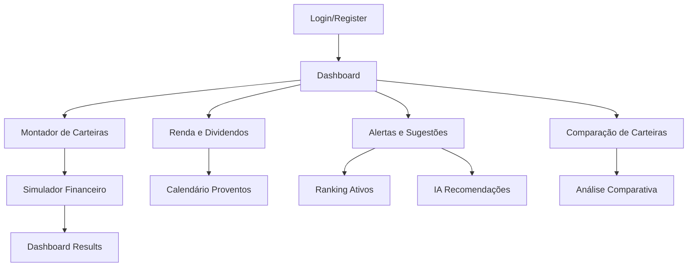

## 1. Product Overview
Aplicação de investimentos avançada para investidores arrojados focados em acumulação de patrimônio no curto e médio prazo. Permite montagem de carteiras personalizadas, simulações financeiras e gestão inteligente de ativos brasileiros e internacionais.

- Resolve o problema de falta de ferramentas integradas para análise e simulação de investimentos com foco em renda mensal
- Permite decisões baseadas em dados para maximizar retornos com controle de risco
- Target: Investidores arrojados que buscam renda mensal e crescimento patrimonial acelerado

## 2. Core Features

### 2.1 User Roles
| Role | Registration Method | Core Permissions |
|------|---------------------|------------------|
| Investidor | Email + verificação | Criar carteiras, simulações, receber alertas |
| Investidor Premium | Assinatura mensal | IA avançada, simulações ilimitadas, alertas personalizados |

### 2.2 Feature Module
Nossa aplicação de investimentos consiste nos seguintes módulos principais:
1. **Dashboard**: visão geral da carteira, gráficos de evolução, cards de indicadores
2. **Montador de Carteiras**: seleção de ativos, alocação de percentuais, simulação de aportes
3. **Simulador Financeiro**: projeções mensais/anuais, cenários conservador/moderado/arrojado, cálculo de juros compostos
4. **Renda e Dividendos**: calendário de proventos, dividend yield, separação BR/Internacional
5. **Alertas e Sugestões**: monitoramento automático, ranking de ativos, recomendações de aportes
6. **Comparação de Carteiras**: análise Brasil vs Internacional, performance total, volatilidade

### 2.3 Page Details
| Page Name | Module Name | Feature description |
|-----------|-------------|---------------------|
| Login | Autenticação | Login com email/senha, recuperação de senha, registro de novo usuário |
| Dashboard | Visão Geral | Exibir evolução patrimonial, renda mensal, alocação por ativo, indicadores-chave |
| Dashboard | Gráficos Interativos | Gráfico de linha temporal do patrimônio, pizza de alocação, barras de renda mensal |
| Dashboard | Cards de Indicadores | Rentabilidade acumulada, CAGR, volatilidade, drawdown máximo, exposição cambial |
| Montador de Carteiras | Criação de Carteira | Nomear carteira, definir objetivo, selecionar perfil de risco |
| Montador de Carteiras | Seleção de Ativos | Buscar ativos BR (ações, FIIs, ETFs) e internacionais (ETFs USD, REITs, ADRs) |
| Montador de Carteiras | Alocação de Ativos | Definir percentuais por ativo, validar soma 100%, simular aporte inicial |
| Montador de Carteiras | Simulação de Aportes | Configurar aporte mensal, definir data de início, ativar reinvestimento automático |
| Simulador Financeiro | Projeções de Tempo | Selecionar período (mensal/trimestral/anual), escolher cenário (conservador/moderado/arrojado) |
| Simulador Financeiro | Configurações Avançadas | Ativar/desativar reinvestimento, ajustar taxa de crescimento, considerar inflação |
| Simulador Financeiro | Resultados Detalhados | Exibir tabela mês a mês, gráfico de crescimento, resumo de ganhos compostos |
| Renda e Dividendos | Calendário de Proventos | Visualizar dividendos mensais futuros, histórico de pagamentos, próximos ex-dates |
| Renda e Dividendos | Análise por Ativo | Dividend yield individual, renda acumulada por ativo, crescimento anual de dividendos |
| Renda e Dividendos | Separação Geográfica | Dashboard separado BR vs Internacional, conversão automática USD/BRL e CHF/BRL |
| Alertas e Sugestões | Monitoramento | Verificar queda de dividendos, aumento de volatilidade, desvio do perfil arrojado |
| Alertas e Sugestões | Ranking Mensal | Listar top 5 ativos por retorno esperado, renda mensal, risco x retorno |
| Alertas e Sugestões | Recomendações IA | Sugerir realocação, novo aporte, redução de exposição baseado em análise preditiva |
| Comparação de Carteiras | Seleção de Carteiras | Escolher até 3 carteiras para comparar, selecionar período de análise |
| Comparação de Carteiras | Métricas Comparativas | Rentabilidade total, renda mensal média, volatilidade, drawdown máximo, Sharpe ratio |
| Comparação de Carteiras | Visualizações | Gráficos lado a lado, tabela comparativa, análise de correlação entre carteiras |

## 3. Core Process

### Fluxo Principal do Investidor
1. Usário realiza cadastro e define perfil arrojado
2. Cria primeira carteira selecionando ativos BR e internacionais
3. Define alocação de percentuais e configura aporte mensal
4. Ativa reinvestimento automático de dividendos
5. Visualiza projeções financeiras para curto/médio prazo
6. Acompanha evolução patrimonial através do dashboard
7. Recebe alertas sobre mudanças nos ativos
8. Utiliza sugestões de IA para otimizar carteira
9. Compara performance com outras estratégias

## 4. User Interface Design

### 4.1 Design Style
- **Cores Primárias**: Verde #00D084 (crescimento), Azul #1E3A8A (confiança)
- **Cores Secundárias**: Cinza #6B7280 (neutro), Vermelho #EF4444 (perda)
- **Botões**: Estilo arredondado com hover effects, primary buttons com gradiente verde
- **Fontes**: Inter para textos, Space Grotesk para números e valores financeiros
- **Layout**: Card-based com sombras suaves, navegação lateral collapsible
- **Ícones**: Feather Icons com peso consistente, emojis para categorias de ativos
- **Animações**: Transições suaves de 200ms, gráficos com animação on-load

### 4.2 Page Design Overview
| Page Name | Module Name | UI Elements |
|-----------|-------------|-------------|
| Dashboard | Hero Metrics | Cards grandes com números destacados em Space Grotesk 32px, badges de variação com setas |
| Dashboard | Gráficos | Recharts com tooltips customizados, cores consistentes por categoria de ativo |
| Montador de Carteiras | Tabela de Ativos | DataTable virtualizada, search em tempo real, checkbox para seleção múltipla |
| Montador de Carteiras | Alocação | Sliders interativos com preview percentual, validação visual em tempo real |
| Simulador | Configurações | Form com steppers para valores monetários, date pickers para períodos |
| Simulador | Resultados | Tabela zebra com sticky header, gráfico de área empilhada para evolução |
| Renda | Calendário | Calendário mensal com badges coloridos por valor, tooltip com detalhes ao hover |
| Alertas | Notificações | Toast notifications posicionadas top-right, ícones diferenciados por tipo de alerta |
| Comparação | Visualização | Split-screen responsivo, gráficos sincronizados, legendas interativas |

### 4.3 Responsiveness
- Desktop-first com breakpoints em 1280px, 1024px, 768px, 640px
- Sidebar vira bottom navigation em mobile
- Gráficos adaptam de 4 colunas (desktop) para 1 coluna (mobile)
- Tabelas horizontal scroll em telas < 768px
- Touch optimization com áreas de toque mínimas 44x44px

### 4.4 3D Scene Guidance
Não aplicável - esta aplicação utiliza interface 2D com gráficos interativos.